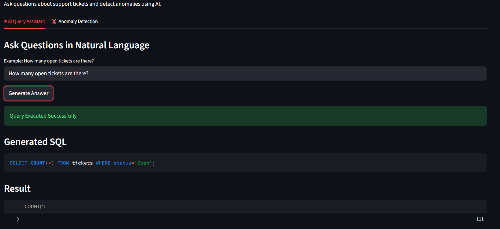
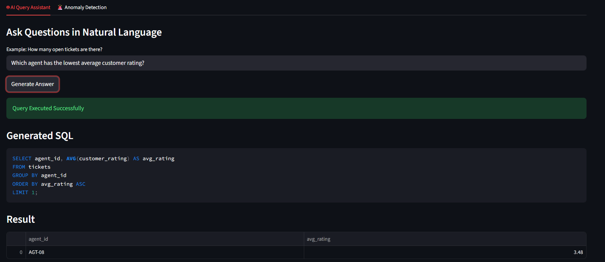
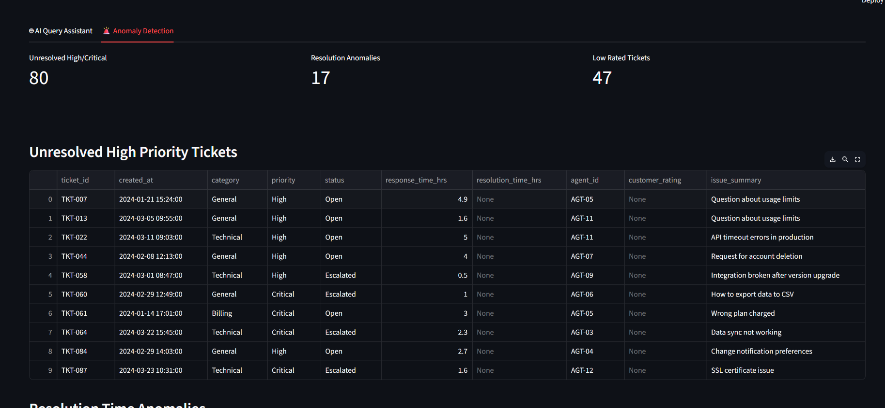
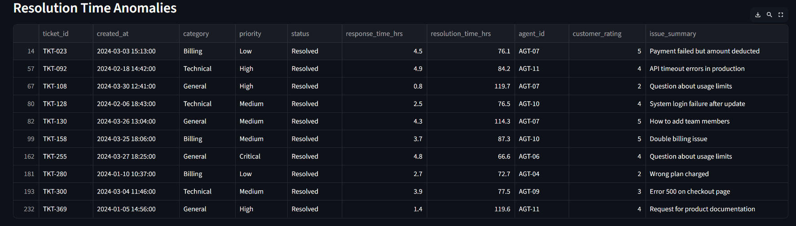
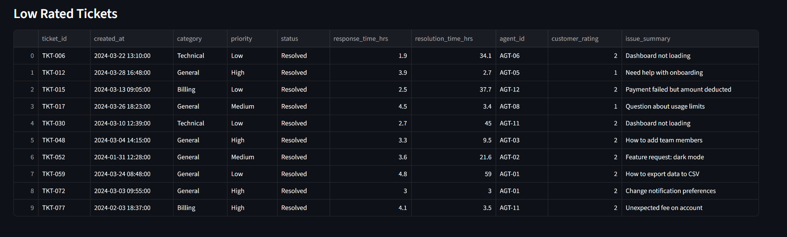

# 🎫 AI-Powered Support Ticket Assistant

An AI-powered analytics system that enables users to query support ticket data using natural language and automatically detect operational anomalies.

The application uses a Large Language Model (LLM) to convert user questions into SQL queries, executes them on a SQLite database, and presents the results through an interactive Streamlit dashboard.

---

## 🚀 Features

### 🤖 Natural Language to SQL

Ask questions in plain English such as:

- How many open tickets are there?
- How many critical tickets are there?
- Which agent has the lowest average customer rating?
- What is the average customer rating for Technical tickets?
- How many unresolved tickets are there?

The system automatically:

1. Converts the question into SQL using a Groq-hosted LLM.
2. Executes the SQL query on a SQLite database.
3. Displays the generated SQL and query results.

---

### 🚨 Anomaly Detection

The application identifies key operational issues:

#### Unresolved High/Critical Tickets
Tickets where:

- Priority = High or Critical
- Status ≠ Resolved

#### Resolution Time Anomalies

Tickets with unusually high resolution times.

#### Low Rated Tickets

Tickets with customer ratings ≤ 2.

---

### 📊 Interactive Dashboard

Built using Streamlit:

- AI Query Assistant
- SQL Visualization
- Query Results Table
- Anomaly Detection Dashboard

---

# 📸 Application Screenshots

## Dashboard

The main dashboard provides access to both AI Query Assistant and Anomaly Detection modules.


---

## Natural Language Query Example

Users can ask questions in plain English and the system automatically generates SQL.

**Question:** How many open tickets are there?



**Result:** 111 Open Tickets

---

## Agent Performance Analysis

Identify agents with lower customer satisfaction ratings.

**Question:** Which agent has the lowest average customer rating?



**Result:** AGT-08 → Average Rating: 3.48

---

## Anomaly Detection

### Unresolved High Priority Tickets



---

### Resolution Time Anomalies



---

### Low Rated Tickets



---

### Summary Results

| Anomaly Type | Count |
|-------------|--------|
| Unresolved High/Critical Tickets | 80 |
| Resolution Time Anomalies | 17 |
| Low Rated Tickets | 47 |

---

# 🏗️ Architecture

```text
User Question
      │
      ▼
Groq LLM
(Natural Language → SQL)
      │
      ▼
Generated SQL
      │
      ▼
SQLite Database
      │
      ▼
Query Results
      │
      ▼
Streamlit Dashboard
